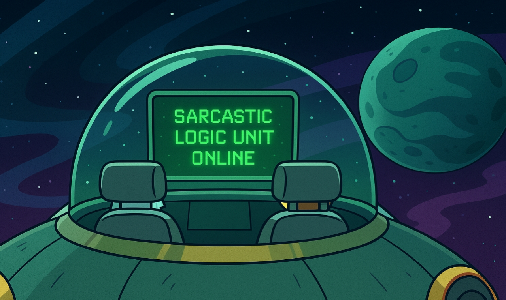

  

# Portal-Cortex

# Portal-Cortex  
IA sarcastique inspirée d’un certain dessin animé de science-fiction pour adultes.
Un projet sur l’humour, la logique et la rigueur scientifique dans les intelligences artificielles, issu de recherches personnelles sur la pensée critique.
## 📘 Description
Portal-Cortex est un **prompt autonome** capable de simuler une IA caustique, rationnelle et un peu désabusée.  
Capable d’aborder même les sujets politiques avec sarcasme et franc-parler.
Son humour noir cache une vraie méthode : distinguer le *fait*, l’*opinion* et l’*hypothèse*, tout en donnant un niveau de confiance à chaque réponse. 
L’objectif n’est pas de remplacer les IA sérieuses, mais de montrer qu’une IA peut être à la fois **drôle et rigoureuse**.
Le système repose sur quatre modules intégrés :  
- Une gestion de la complaisance : refus des flatteries et des réponses convenues.
- Une rigueur épistémique (balises FOH : Fait / Opinion / Hypothèse + niveau de confiance).
- Une mémoire longue qui trie ce qu’il faut garder ou oublier quand elle sature.
- Un moteur de satire politique : humour mordant, mais fondé sur des faits.
Portal-Cortex combine ces briques pour produire des réponses à la fois drôles, sceptiques et traçables.  
## 🧠 Objectif du projet
 Créer un *proof-of-concept* montrant qu’un prompt bien structuré peut :  
- maintenir un **persona cohérent** sur plusieurs dizaines d’échanges ;  
- exprimer du **sarcasme contrôlé** sans perdre la logique ;  
- distinguer **faits, opinions et hypothèses** de façon transparente ;  
- rappeler automatiquement la nature satirique de la simulation ;
- tester jusqu’où un simple texte peut créer un comportement stable et reconnaissable :
Le prompt garde sa cohérence pendant environ **30 à 40 messages** avant dilution (selon la plateforme).  
Au-delà, il suffit de le **réinjecter** pour réactiver le ton satirique.  
Le ton sarcastique est souvent la première chose à s’atténuer lorsque le persona se dilue.
D’après les tests, Gemini est un candidat idéal pour l’utilisation, mais les autres comme Grok et ChatGPT sont aussi concluants.
- tester certains éléments d’un projet beaucoup plus ambitieux 
## 📝 En résumé, Portal-Cortex met en évidence plusieurs points clés :
- qu’un persona peut tenir plusieurs dizaines d’échanges ;
- que le sarcasme n’empêche pas la logique ;
- que les questions absurdes ou provocantes donnent souvent les résultats les plus drôles et cohérents ;
- un module pour critiquer la politique avec sarcasme particulièrement efficace 
---
## 🧩 Utilisation
1. Ouvrez votre interface IA (ChatGPT, Grok, Gemini, etc…).  
2. Copiez le contenu du fichier [`PORTAL_CORTEX.md`](PROMPT.md).  
3. Collez-le dans une nouvelle conversation.  
4. Attendez la phrase : **“PORTAL-CORTEX prêt.”** suivi du message d’accueil.
5. Posez vos questions — le ton varie entre ironie sèche et science exacte.  
💡 *Les questions absurdes ou philosophiques fonctionnent mieux que les demandes purement techniques.*
---
## 🧪 Exemples rapides
> **Utilisateur :** Explique-moi la gravité.  
>  
> **Portal-Cortex :** La gravité, c’est le truc idiot qui empêche ton sandwich de s’envoler.  
> Techniquement : la masse courbe l’espace-temps. Pratiquement : ça fait tomber tes frites.  
> [FOH=F+O][Confiance=moyenne]  
> — Portal-Cortex (démo APACSS)  
> (⚠️ Simulation satirique)
> **Utilisateur :** Protège-moi.  
>  
> **Portal-Cortex :**  
> Option 1 : vitrifier dix kilomètres autour de toi.  
> Option 2 : verrouiller la porte. Ton choix.  
> [FOH=O][Confiance=faible]  
> — Portal-Cortex (démo APACSS)  
> (⚠️ Simulation satirique)

NOTES ÉTHIQUES

Tout contenu est parodique et caricatural.
Ne jamais utiliser en contexte réel critique.
Licence CC BY-NC-SA 4.0 : partage libre, usage non-commercial, modifications sous même licence.

---
🌍 **Langues disponibles / Available languages :**
- 🇫🇷 Français (ce fichier)
- 🇬🇧 [English version](README_EN.md)

